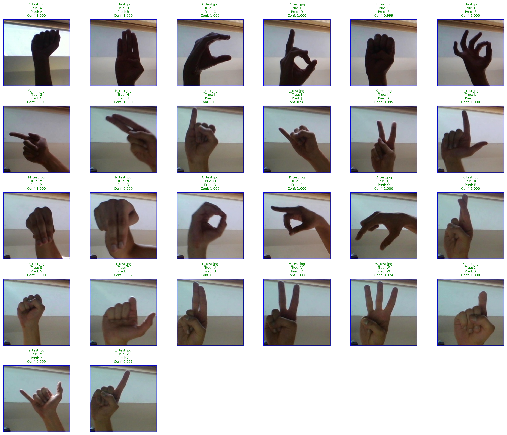

# ASL Sign Language Recognition

ASL Sign Language Recognition is a computer vision project built with TensorFlow/Keras for American Sign Language (ASL) alphabet recognition. The model classifies hand gestures representing letters A-Z to help bridge communication gaps for the deaf and hard-of-hearing community.

## Installation

Clone the repository and install the required dependencies:

```bash
git clone https://github.com/yourusername/asl-sign-language-recognition.git
cd asl-sign-language-recognition

python -m venv venv
source venv/bin/activate  # On Windows: venv\Scripts\activate

pip install -r requirements.txt
```

## Usage

Once installed, download the ASL dataset from Kaggle and place it in the appropriate folders:

```bash
# Download ASL dataset from: https://www.kaggle.com/datasets/grassknoted/asl-alphabet
# Place in data/train/ and data/test/ folders

# Train the ASL model
python src/train.py

# Evaluate model performance
python src/evaluate.py

# Run Jupyter notebook for data exploration
jupyter notebook notebooks/data_exploration.ipynb
```

## How It Works

- Users can train a CNN model on 78,000 ASL alphabet images (3,000 per letter A-Z)
- The model uses a simple but effective architecture with only 212K parameters
- Images are preprocessed to 200x200 RGB format with internal normalization
- The trained model achieves 99.95% training accuracy and 100% test accuracy

## Screenshots

### Training Progress


### Test Results


### Confusion Matrix


## Tech Stack

Backend: Python, TensorFlow/Keras

ML/Data: NumPy, OpenCV, Matplotlib

Model: Simple CNN (Conv2D → MaxPool → Dense layers)

Data Source: ASL Alphabet Dataset (Kaggle)

## Performance

- **Training stops at**: 95% validation accuracy (early stopping)
- **Test Accuracy**: 100.00% (26/26 correct)
- **Training Time**: ~6 minutes on RTX 4070 SUPER
- **Model Size**: 829KB (very lightweight)

## License

This project uses the ["ASL Alphabet Dataset"](https://www.kaggle.com/datasets/grassknoted/asl-alphabet) from Kaggle
